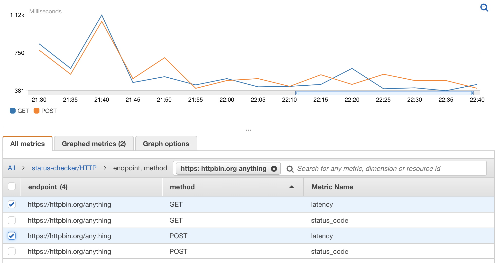

# status-checker

status-checker is a small service which checks
the HTTP status code and latency for one or more
endpoints

The result is save to AWS CloudWatch, where you can use
the result to trigger other events.



Following metrics are pushed to AWS CloudWatch using
namespace `status-checker/HTTP` and dimension `Endpoint`
and `Method`.

| MetricName   | Description            | Unit         |
| ------------ | ---------------------- | ------------:|
| Latency      | request time           | Milliseconds |
| HTTPCode     | HTTP status code       | None         |
| HTTPCode_YXX | Number of 2XX, 3XX,... | None         |

## Getting Started

status-checker is configured by providing a JSON list of objects
with following properties.

 - `url`: fully qualified uri
 - `method`: http method (default: "GET")
 - `headers` - http headers (default: {})

### Example

```
[
    {"url": "example.com"},
    {"url": "post.example.com", "method": "POST"},
    {"url": "test.example.com", "headers": {"Authorization": "Basic "}}
]
```

### Installing

The application can be deployed with aws cloudformation.

```
yarn install --production

aws cloudformation package \
    --template-file cloudformation/status-checker-template.yml \
    --output-template-file /tmp/deploy-status-checker-template.yml \
    --s3-bucket "${BUCKET}"

aws cloudformation deploy \
    --capabilities CAPABILITY_IAM \
    --template-file /tmp/deploy-status-checker-template.yml \
    --stack-name status-checker
```

#### Configure status checker

Setup the status checker for and url by creating a configuration stack

```
configuration=$(cat <<EOF | base64
[
  {
    "url": "http://example.com"
  }
]
EOF
)

aws cloudformation create-stack \
    --stack-name status-checker-example-com \
    --template-body file://cloudformation/status-checker-configuration-template.yml \
    --parameters \
        "ParameterKey=StatusCheckerStackName,ParameterValue=status-checker" \
        "ParameterKey=StatusCheckerName,ParameterValue=example-com" \
        "ParameterKey=StatusCheckerConfiguration,ParameterValue=${configuration}"
```

> The default schedule is every 5 minutes. It can be changed by using the
> `StatusCheckerScheduleExpression` parameter

The metrics can be view in AWS console or by querying using aws

```
aws cloudwatch get-metric-statistics \
    --metric-name Latency \
    --start-time 2020-07-25T20:00:00 \
    --end-time 2020-07-26T04:00:00 \
    --period 60 \
    --statistics Average \
    --namespace status-checker/HTTP \
    --dimensions \
       'Name=Method,Value=GET' \
       'Name=Endpoint,Value=http://example.com'
{
    "Label": "Latency",
    "Datapoints": [
        {
            "Timestamp": "2020-07-25T21:55:00+00:00",
            "Average": 249.07750599999986,
            "Unit": "Milliseconds"
        },
        {
            "Timestamp": "2020-07-25T21:50:00+00:00",
            "Average": 235.51812300000006,
            "Unit": "Milliseconds"
        }
    ]
}
```


